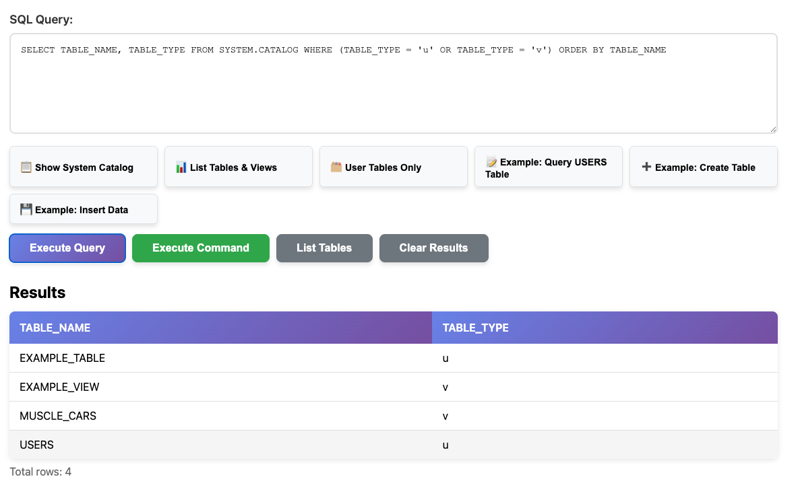
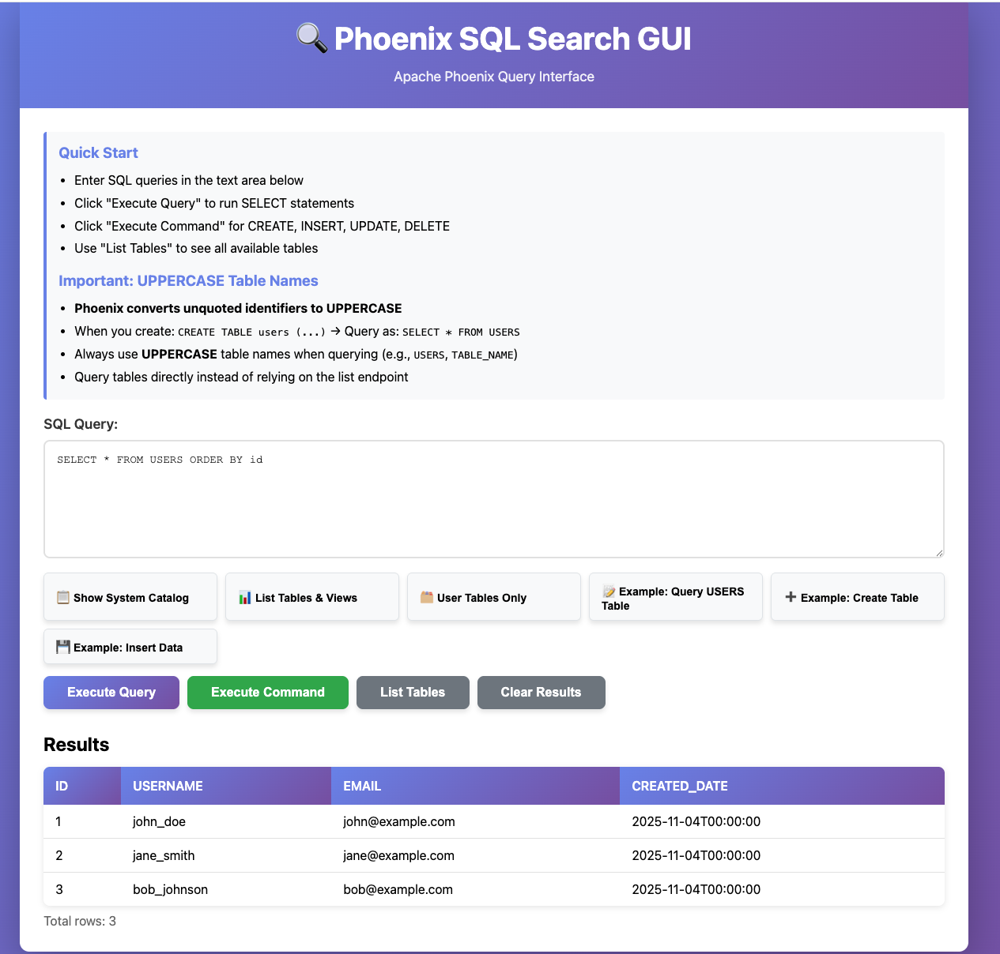
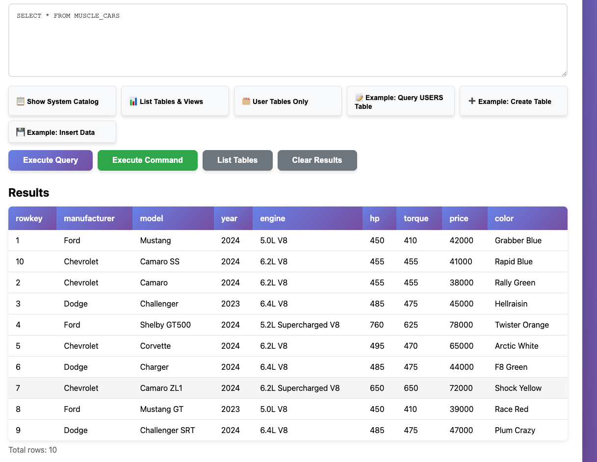

# PhoenixDotNet - Apache Phoenix .NET REST API Application

A C# .NET web application that provides a REST API and SQL Search GUI for Apache Phoenix. The application connects to Phoenix Query Server using **ODBC as the primary connection method** with **REST API as an automatic fallback**.

## 📚 For Development Teams

**New to this project?** Start with the **[Documentation/QUICKSTART.md](Documentation/QUICKSTART.md)** for a quick setup guide, or the **[Documentation/DEVELOPMENT_HANDBOOK.md](Documentation/DEVELOPMENT_HANDBOOK.md)** - a comprehensive handoff guide that includes:
- Complete component descriptions
- Architecture diagrams
- Project structure glossary
- Development workflow
- Configuration guide
- API reference
- Testing guide
- Troubleshooting
- Examples and use cases

## Prerequisites

> **📖 For a complete setup guide, see [Documentation/QUICKSTART.md](Documentation/QUICKSTART.md)**

1. **.NET 8.0 SDK** or later
   - Download from: https://dotnet.microsoft.com/download

2. **Docker and Docker Compose**
   - For running Apache Phoenix locally using the provided docker-compose files
   - ODBC driver is automatically installed during Docker build (if driver files are available)
   - **Note**: Docker build will succeed even without ODBC driver files - the app will use REST API fallback
   - See [Documentation/SETUP.md](Documentation/SETUP.md) for Docker build configuration details

3. **Apache Phoenix ODBC Driver** (optional - for local development)
   - **Important**: ODBC connectors require a Cloudera subscription to download
   - **Note**: The ODBC driver is optional. If you don't have the driver files, the Docker build will still succeed and the application will automatically use the REST API fallback instead of ODBC
   - Download from: Cloudera customer portal (requires subscription)
   - The `ODBC/` directory is not tracked in git (it's in `.gitignore`)
   - If you have the driver files, place them at: `ODBC/1.0.8.1011/Linux/HortonworksPhoenix-64bit-1.0.8.1011-1.rpm`
   - For production use, download the latest driver from your Cloudera subscription
   - See [Documentation/ODBC_INSTALLATION.md](Documentation/ODBC_INSTALLATION.md) for detailed installation instructions
   - See [Documentation/PHOENIX_ODBC_SETUP.md](Documentation/PHOENIX_ODBC_SETUP.md) for setup and configuration

4. **Apache Phoenix Query Server**
   - Included in the docker-compose setup
   - Runs on port 8765
   - Uses Avatica protocol (JSON/Protobuf)

## Quick Setup

The ODBC configuration files (`odbcinst.ini` and `odbc.ini`) are included in the repository and ready to use. The Dockerfile will automatically copy them to the container during build.

**Installing the ODBC Driver:**

If you need to manually install the Phoenix ODBC driver (e.g., in a Docker container or for local development), use the provided installation script:

```bash
# Copy the RPM file to /tmp/phoenix-odbc.rpm first, then run:
./install_odbc.sh
```

The `install_odbc.sh` script will:
- Extract the Phoenix ODBC driver RPM
- Install the driver libraries to `/usr/lib/x86_64-linux-gnu/odbc/`
- Copy configuration files and error messages
- Verify the installation

**Verifying the ODBC Installation:**

After installing the ODBC driver, verify the installation using the provided verification script:

```bash
./verify_odbc.sh
```

The `verify_odbc.sh` script will:
- Check if the container is running
- Verify ODBC driver is registered with `odbcinst`
- Check if driver library files exist in the expected location
- Verify `odbcinst.ini` configuration
- Check application logs for ODBC connection status
- Test the connection via health check endpoint

If you need to customize these files for your environment, you can edit them directly. See [Documentation/SETUP.md](Documentation/SETUP.md) for Docker build setup and ODBC configuration details.

> **📖 For step-by-step setup instructions, see [Documentation/QUICKSTART.md](Documentation/QUICKSTART.md)**

## Project Structure

```
PhoenixDotNet/
├── PhoenixDotNet.csproj           # .NET project file
├── Program.cs                     # Web application entry point
├── Controllers/
│   └── PhoenixController.cs       # REST API controller
├── PhoenixRestClient.cs           # Phoenix REST API client (Avatica protocol)
├── HBaseRestClient.cs             # HBase REST API client
├── PhoenixConnectionInitializer.cs # Background service for connection initialization
├── wwwroot/
│   └── index.html                 # SQL Search GUI
├── images/                        # GUI screenshots
│   ├── List_tables_views.png      # List tables and views screenshot
│   ├── phoenix_table_example.png  # Phoenix table query example
│   └── phoenix_view_example.png   # Phoenix view query example
├── appsettings.json               # Configuration file
├── docker-compose.yml             # Docker Compose for OPDB (includes Phoenix)
├── hbase-site.xml                 # HBase configuration (mounted to container)
├── use-cases/                     # Use case examples and documentation
│   └── student360/                # Student 360-degree view use case
│       ├── README.md              # Complete use case documentation
│       ├── sample_queries.sql     # 38+ sample SQL queries
│       └── create_student_360_single_view.sh  # Implementation script
└── README.md                      # This file
```

## Quick Start

> **📖 For detailed setup instructions, see [Documentation/QUICKSTART.md](Documentation/QUICKSTART.md)**

### Run Everything with Docker Compose (Recommended)

Deploy both Phoenix and the application using Docker Compose:

```bash
# Build and start all services
docker-compose up --build

# Or run in detached mode
docker-compose up --build -d

# View application logs
docker-compose logs -f phoenix-app

# Check if services are ready (may take 60-90 seconds for HBase/Phoenix initialization)
docker-compose ps
```

**Access Points:**
- **SQL Search GUI**: http://localhost:8100
- **REST API**: http://localhost:8099/api/phoenix/*
- **API Health Check**: http://localhost:8099/api/phoenix/health

See [Documentation/DOCKER.md](Documentation/DOCKER.md) for detailed container deployment instructions.

### Run Application Locally with Phoenix in Container

> **📖 For detailed local development setup, see [Documentation/QUICKSTART.md](Documentation/QUICKSTART.md)**

1. **Start Apache Phoenix using Docker Compose:**
```bash
docker-compose up -d opdb-docker
```

This starts the Cloudera OPDB Docker image which includes Apache Phoenix Query Server on port 8765.

2. **Verify Phoenix is Running:**
```bash
# Check if port 8765 is listening
docker ps | grep opdb-docker

# Wait for Phoenix to fully initialize (60-90 seconds)
docker logs -f opdb-docker
```

3. **Configure the Connection:**
Edit `appsettings.json` to match your Phoenix setup:

```json
{
  "Phoenix": {
    "Server": "localhost",
    "Port": "8765",
    "ConnectionString": "Driver={Phoenix ODBC Driver};Host=localhost;Port=8765"
  },
  "HBase": {
    "Server": "localhost",
    "Port": "8080"
  }
}
```

**Notes:**
- The ODBC driver is automatically installed when using Docker
- If ODBC driver installation fails, you can manually install it using `./install_odbc.sh` (copy the RPM file to `/tmp/phoenix-odbc.rpm` first)
- The connection string uses `Host=` instead of `Server=` (Hortonworks driver requirement)
- **Important**: ODBC connectors must be downloaded with a Cloudera subscription
- For Docker build and ODBC configuration setup, see [Documentation/SETUP.md](Documentation/SETUP.md)
- For local development setup, see [Documentation/QUICKSTART.md](Documentation/QUICKSTART.md)
- For detailed ODBC installation, see [Documentation/ODBC_INSTALLATION.md](Documentation/ODBC_INSTALLATION.md) and [Documentation/PHOENIX_ODBC_SETUP.md](Documentation/PHOENIX_ODBC_SETUP.md)

4. **Build and Run the Application:**
```bash
dotnet restore
dotnet build
dotnet run
```

The application will be available at:
- http://localhost:8099 (API)
- http://localhost:8100 (GUI)

## Application Features

### REST API Endpoints

The application provides a REST API on port **8099**:

#### Phoenix Operations
- `GET /api/phoenix/health` - Health check endpoint
- `GET /api/phoenix/tables` - List all tables
- `GET /api/phoenix/tables/{tableName}/columns` - Get column information for a table
- `POST /api/phoenix/query` - Execute SQL SELECT queries
- `POST /api/phoenix/execute` - Execute SQL commands (CREATE, INSERT, UPDATE, DELETE)

#### Phoenix Views (for HBase Native Tables)
- `GET /api/phoenix/views` - List all views
- `GET /api/phoenix/views/{viewName}` - Get view details and columns
- `GET /api/phoenix/views/{viewName}/columns` - Get column information for a view
- `POST /api/phoenix/views` - Create a Phoenix view on an HBase table
- `DELETE /api/phoenix/views/{viewName}` - Drop a view

> **📖 For detailed Phoenix Views documentation, see the [Phoenix Views](#phoenix-views) section below.**

#### HBase Operations
- `POST /api/phoenix/hbase/tables/sensor` - Create sensor information table
- `GET /api/phoenix/hbase/tables/{tableName}/exists` - Check if table exists
- `GET /api/phoenix/hbase/tables/{tableName}/schema` - Get table schema

### SQL Search GUI

A web-based SQL query interface on port **8100**:
- Interactive SQL query editor
- Execute queries and view results in formatted tables
- Quick query buttons for common operations
- Real-time error messages and status updates

#### GUI Screenshots

**List Tables and Views:**


**Phoenix Table Query Example:**


**Phoenix View Query Example:**


### Features

1. **ODBC Connection** - Primary connection method (automatically installed during Docker build)
2. **REST API Fallback** - Automatic fallback if ODBC is unavailable
3. **SQL Search GUI** - Web-based interface for querying Phoenix
4. **HBase Integration** - Direct HBase REST API operations
5. **Connection Management** - Automatic connection initialization and retry logic
6. **Error Handling** - Detailed error messages with troubleshooting guidance

## API Usage Examples

### Using the REST API

#### Health Check
```bash
curl http://localhost:8099/api/phoenix/health
```

#### List Tables
```bash
curl http://localhost:8099/api/phoenix/tables
```

#### Execute a Query
```bash
curl -X POST http://localhost:8099/api/phoenix/query \
  -H "Content-Type: application/json" \
  -d '{"sql":"SELECT * FROM SYSTEM.CATALOG LIMIT 10"}'
```

#### Execute a Command
```bash
curl -X POST http://localhost:8099/api/phoenix/execute \
  -H "Content-Type: application/json" \
  -d '{"sql":"CREATE TABLE IF NOT EXISTS testtable (id INTEGER PRIMARY KEY, name VARCHAR(100))"}'
```

#### Get Column Information
```bash
curl http://localhost:8099/api/phoenix/tables/testtable/columns
```

#### Create HBase Table
```bash
curl -X POST http://localhost:8099/api/phoenix/hbase/tables/sensor \
  -H "Content-Type: application/json" \
  -d '{"tableName":"SENSOR_INFO","namespace":"default"}'
```

#### List All Views
```bash
curl http://localhost:8099/api/phoenix/views
```

#### Get View Details
```bash
curl http://localhost:8099/api/phoenix/views/sensor_readings_view
```

#### Get View Columns
```bash
curl http://localhost:8099/api/phoenix/views/sensor_readings_view/columns
```

#### Create Phoenix View for HBase Table

> **📖 For detailed Phoenix Views documentation with examples, see the [Phoenix Views](#phoenix-views) section below.**

Quick example:
```bash
curl -X POST http://localhost:8099/api/phoenix/views \
  -H "Content-Type: application/json" \
  -d '{
    "viewName": "SENSOR_READINGS",
    "hBaseTableName": "SENSOR_READINGS",
    "namespace": "default",
    "columns": [
      { "name": "rowkey", "type": "VARCHAR", "isPrimaryKey": true },
      { "name": "sensor_type", "type": "VARCHAR", "isPrimaryKey": false },
      { "name": "timestamp", "type": "BIGINT", "isPrimaryKey": false },
      { "name": "temperature", "type": "DOUBLE", "isPrimaryKey": false }
    ]
  }'
```

⚠️ **CRITICAL**: View names must be UPPERCASE and match the HBase table name exactly. See [Phoenix Views](#phoenix-views) section for details.

### Using C# Code

```csharp
using PhoenixDotNet;
using Microsoft.Extensions.Configuration;

var configuration = new ConfigurationBuilder()
    .AddJsonFile("appsettings.json")
    .Build();

// Create Phoenix REST client
using var phoenix = new PhoenixRestClient(configuration);
await phoenix.OpenAsync();

// Execute a query
var results = await phoenix.ExecuteQueryAsync("SELECT * FROM users WHERE id = 1");

// Execute a command
await phoenix.ExecuteNonQueryAsync("UPSERT INTO users (id, username) VALUES (1, 'john')");

// Get tables
var tables = await phoenix.GetTablesAsync();

// Get columns
var columns = await phoenix.GetColumnsAsync("users");
```

## Phoenix SQL Notes

Apache Phoenix uses SQL syntax with some differences from standard SQL:

- **UPSERT** instead of INSERT/UPDATE
- **Schema.Catalog** for system metadata queries
- Case-sensitive table and column names (typically uppercase)
- Support for Phoenix-specific data types
- **Phoenix Views on HBase Tables**: Use `TO_NUMBER()` for numeric conversions (not `CAST()`)
  - Example: `TO_NUMBER("column_name") >= 3.5` (for VARCHAR columns in HBase-native tables)

Example CREATE TABLE:
```sql
CREATE TABLE IF NOT EXISTS users (
    id INTEGER PRIMARY KEY,
    username VARCHAR(50),
    email VARCHAR(100),
    created_date DATE
)
```

Example UPSERT:
```sql
UPSERT INTO users (id, username, email, created_date) 
VALUES (1, 'john_doe', 'john@example.com', CURRENT_DATE())
```

## Adding Data to Tables

The best way to add rows to a table depends on whether it's a **Phoenix table** or an **HBase-native table**.

### For Phoenix Tables (Created via Phoenix SQL)

**✅ Use Phoenix SQL (UPSERT) - Recommended**

Phoenix tables use binary encoding that cannot be replicated via HBase shell. Always use Phoenix SQL:

```bash
# Via REST API
curl -X POST http://localhost:8099/api/phoenix/execute \
  -H "Content-Type: application/json" \
  -d '{
    "sql": "UPSERT INTO users (id, username, email, created_date) VALUES (7, '\''grace_lee'\'', '\''grace@example.com'\'', CURRENT_DATE())"
  }'
```

**Benefits:**
- ✅ Automatically handles binary encoding
- ✅ Ensures data integrity and type safety
- ✅ Works immediately with Phoenix queries
- ✅ No manual encoding required

### For HBase-Native Tables (Created via HBase Shell)

**✅ Use HBase Shell/REST API + Phoenix Views**

For HBase-native tables, insert data via HBase shell or REST API, then create a Phoenix view to query it:

⚠️ **CRITICAL:** When creating Phoenix views on HBase tables:
- **View names MUST be UPPERCASE** (e.g., `EMPLOYEE_DATA`, not `employee_data`)
- **View name MUST match HBase table name exactly** (case-sensitive)
- Both the HBase table and view must use the same uppercase name

```bash
# Option 1: Insert via HBase shell
# Note: Create table with UPPERCASE name first: create 'EMPLOYEE_DATA', 'info', 'contact'
docker-compose exec -T opdb-docker /opt/hbase/bin/hbase shell <<EOF
put 'EMPLOYEE_DATA', '1', 'info:name', 'Alice'
put 'EMPLOYEE_DATA', '1', 'info:score', '100'
put 'EMPLOYEE_DATA', '1', 'contact:email', 'alice@example.com'
EOF

# Option 2: Insert via HBase REST API
curl -X PUT http://localhost:8099/api/phoenix/hbase/tables/EMPLOYEE_DATA/data \
  -H "Content-Type: application/json" \
  -d '{
    "rowKey": "1",
    "columnFamily": "info",
    "column": "name",
    "value": "Alice",
    "namespace": "default"
  }'

# Then create a Phoenix view to query the data
# IMPORTANT: Both viewName and hBaseTableName must be UPPERCASE and match exactly
curl -X POST http://localhost:8099/api/phoenix/views \
  -H "Content-Type: application/json" \
  -d '{
    "viewName": "EMPLOYEE_DATA",
    "hBaseTableName": "EMPLOYEE_DATA",
    "namespace": "default",
    "columns": [
      { "name": "rowkey", "type": "VARCHAR", "isPrimaryKey": true },
      { "name": "name", "type": "VARCHAR", "columnFamily": "info" },
      { "name": "score", "type": "INTEGER", "columnFamily": "info" }
    ]
  }'
```

### Quick Decision Guide

| Table Type | Insert Method | Query Method |
|------------|--------------|--------------|
| **Phoenix table** (created via `CREATE TABLE`) | Phoenix SQL (UPSERT) | Phoenix SQL (SELECT) |
| **HBase-native table** (created via `create 'table'`) | HBase shell/REST API | Phoenix View or direct HBase query |

### Important Notes

- ⚠️ **Don't mix methods**: For Phoenix tables, always use Phoenix SQL (UPSERT). HBase shell inserts won't work correctly with Phoenix queries due to encoding differences.
- ⚠️ **HBase shell limitation**: HBase shell treats escape sequences like `\x80` as literal strings, not binary bytes, so it cannot replicate Phoenix's binary encoding.
- ✅ **Phoenix views**: For HBase-native tables, Phoenix views provide SQL access without requiring data migration.

For more details, see [Documentation/README_TABLES.md](Documentation/README_TABLES.md).

## Phoenix Views

The application provides comprehensive support for Phoenix views, which are essential for reading from HBase-native tables. Phoenix views provide a SQL interface to query HBase tables without requiring data migration.

### ⚠️ CRITICAL: View Name Requirements for HBase Tables

**Before creating a Phoenix view on an HBase table, you MUST:**

1. **Use UPPERCASE for both HBase table and view names**: Phoenix requires uppercase names (e.g., `MUSCLE_CARS`, not `muscle_cars`)
2. **Match names exactly**: The view name must exactly match the HBase table name (case-sensitive)

**Example:**
```bash
# Create HBase table with UPPERCASE name
create 'MUSCLE_CARS', 'info', 'specs', 'details'

# Create Phoenix view with the SAME UPPERCASE name
CREATE VIEW "MUSCLE_CARS" (
    "rowkey" VARCHAR PRIMARY KEY,
    "info"."manufacturer" VARCHAR,
    ...
)
```

**Why this matters:**
- Phoenix views on HBase tables require the view name to match the HBase table name exactly (case-sensitive)
- If you query `SELECT * FROM muscle_cars` (unquoted), Phoenix converts it to uppercase `MUSCLE_CARS`, so the view must be uppercase to work with unquoted queries
- If names don't match exactly, Phoenix will not recognize the underlying HBase table

**Best Practice:** Always create HBase tables with uppercase names to match Phoenix view naming conventions.

### View Management Endpoints

- **List Views**: `GET /api/phoenix/views` - List all Phoenix views
- **Get View Details**: `GET /api/phoenix/views/{viewName}` - Get view information and columns
- **Get View Columns**: `GET /api/phoenix/views/{viewName}/columns` - Get column information for a view
- **Create View**: `POST /api/phoenix/views` - Create a Phoenix view on an HBase table
- **Drop View**: `DELETE /api/phoenix/views/{viewName}` - Drop a view

### View Usage

Views are read-only and ideal for querying HBase-native tables. After creating an HBase table and inserting data via HBase shell or REST API, create a Phoenix view to query it using SQL.

See [Documentation/README_VIEWS.md](Documentation/README_VIEWS.md) for:
- Detailed view creation and usage examples
- Available views (active_users_view, user_summary_view, etc.)
- Critical requirements for HBase table views
- Query examples
- Best practices for working with HBase-native tables

**📋 Use Case Example**: See [use-cases/student360/README.md](use-cases/student360/README.md) for a complete 360-degree view implementation demonstrating single wide HBase table design with Phoenix view, including 38+ sample SQL queries.

## Troubleshooting

> **📖 For comprehensive troubleshooting information, see [Documentation/TROUBLESHOOTING.md](Documentation/TROUBLESHOOTING.md)**

The troubleshooting guide includes:
- Common connection errors and solutions
- Docker container issues
- Protocol errors (JSON/Protobuf)
- Table not found errors
- ODBC driver installation and configuration
- Alternative connection methods
- Debugging steps and verification checklists
- Complete error resolution guide

## Container Deployment

This application can be deployed in a Docker container. For Docker build setup and ODBC configuration, see [Documentation/SETUP.md](Documentation/SETUP.md). For a quick start with Docker, see [Documentation/QUICKSTART.md](Documentation/QUICKSTART.md). For detailed deployment information, see [Documentation/DOCKER.md](Documentation/DOCKER.md) for:

- Dockerfile configuration
- Docker Compose setup
- Container networking
- ODBC driver installation in containers
- Production deployment considerations

**Important**: ODBC connectors require a Cloudera subscription to download. The ODBC drivers included in the `ODBC/` directory are provided for development purposes only.

## Architecture

### System Architecture

```
┌─────────────────────────────────────────────────────────────────────────┐
│                          Client Layer                                    │
│                                                                           │
│  ┌──────────────┐              ┌──────────────┐                         │
│  │  Web Browser │              │  REST Client │                         │
│  │  (Port 8100) │              │  (Port 8099)│                         │
│  │  SQL GUI     │              │  API Calls   │                         │
│  └──────┬───────┘              └──────┬───────┘                         │
└─────────┼─────────────────────────────┼─────────────────────────────────┘
          │                             │
          │ HTTP                        │ HTTP
          │                             │
┌─────────▼─────────────────────────────▼─────────────────────────────────┐
│                    PhoenixDotNet Application                            │
│                                                                          │
│  ┌────────────────────────────────────────────────────────────────┐   │
│  │         ASP.NET Core Web Application (Program.cs)              │   │
│  │         - Service Registration                                 │   │
│  │         - Dependency Injection                                 │   │
│  │         - Multi-port Configuration (8099, 8100)                │   │
│  └────────────────────────────┬───────────────────────────────────┘   │
│                               │                                         │
│  ┌────────────────────────────▼───────────────────────────────────┐   │
│  │              PhoenixController (REST API)                       │   │
│  │  Endpoints:                                                     │   │
│  │  - GET  /api/phoenix/tables                                     │   │
│  │  - GET  /api/phoenix/tables/{name}/columns                      │   │
│  │  - POST /api/phoenix/query                                      │   │
│  │  - POST /api/phoenix/execute                                    │   │
│  │  - POST /api/phoenix/hbase/tables/sensor                        │   │
│  │  - GET  /api/phoenix/hbase/tables/{name}/exists                 │   │
│  │  - GET  /api/phoenix/hbase/tables/{name}/schema                 │   │
│  └──────────────┬──────────────────────────┬───────────────────────┘   │
│                 │                          │                           │
│  ┌──────────────▼──────────┐   ┌──────────▼──────────┐               │
│  │   PhoenixRestClient     │   │  HBaseRestClient     │               │
│  │                         │   │                      │               │
│  │  Methods:               │   │  Methods:            │               │
│  │  - OpenAsync()          │   │  - CreateTableAsync()│               │
│  │  - ExecuteQueryAsync()  │   │  - TableExistsAsync()│              │
│  │  - ExecuteNonQueryAsync()│   │  - GetTableSchemaAsync()│            │
│  │  - GetTablesAsync()     │   │  - PutDataAsync()     │               │
│  │  - GetColumnsAsync()    │   │                      │               │
│  │  - CloseAsync()         │   │                      │               │
│  │                         │   │                      │               │
│  │  Features:              │   │  Features:           │               │
│  │  - Retry Logic (10x)     │   │  - Namespace Support │               │
│  │  - Connection Mgmt      │   │  - Column Families    │               │
│  │  - Avatica Protocol     │   │  - Schema Operations │               │
│  └──────────────┬──────────┘   └──────────┬──────────┘               │
│                 │                          │                           │
│  ┌──────────────▼──────────────────────────▼──────────┐              │
│  │         PhoenixConnectionInitializer                │              │
│  │         (Background Service - IHostedService)        │              │
│  │         - Waits 30s for HBase initialization       │              │
│  │         - Attempts connection on startup            │              │
│  │         - Graceful failure handling                  │              │
│  └─────────────────────────────────────────────────────┘              │
└──────────────────┬──────────────────────────┬─────────────────────────┘
                   │                          │
                   │ HTTP/JSON                │ HTTP/JSON
                   │ (Avatica Protocol)       │ (REST API - Stargate)
                   │                          │
┌──────────────────▼──────────┐   ┌───────────▼──────────┐
│  Phoenix Query Server       │   │  HBase REST API     │
│  (Port 8765)                │   │  (Port 8080)         │
│                             │   │                      │
│  Features:                  │   │  Features:           │
│  - Avatica Protocol         │   │  - Table Management  │
│  - JSON/Protobuf Support    │   │  - Schema Operations │
│  - Connection Management    │   │  - Data Operations   │
│  - SQL Query Processing     │   │  - Namespace Support │
│  - Result Set Handling      │   │                      │
└──────────────┬─────────────┘   └───────────┬──────────┘
               │                              │
               └──────────────┬───────────────┘
                              │
                    ┌─────────▼─────────┐
                    │  Apache Phoenix   │
                    │  (HBase Layer)    │
                    │                   │
                    │  - SQL Interface  │
                    │  - Query Engine   │
                    │  - View Support   │
                    │  - Indexing       │
                    └───────────────────┘
```

### Data Flow: Query Execution

```
1. Client Request
   │
   ▼
2. PhoenixController.ExecuteQuery()
   │  - Validates request
   │  - Ensures connection
   │
   ▼
3. PhoenixRestClient.OpenAsync() [if not connected]
   │  - Retry logic (up to 10 attempts, 15s delays)
   │  - Connection ID management
   │  - Avatica protocol handshake
   │
   ▼
4. PhoenixRestClient.ExecuteQueryAsync()
   │  - Builds Avatica request: {"request": "prepareAndExecute", ...}
   │  - Sends HTTP POST to Phoenix Query Server
   │  - Handles JSON serialization
   │
   ▼
5. Phoenix Query Server
   │  - Processes SQL query
   │  - Executes against HBase
   │  - Returns Avatica response with results
   │
   ▼
6. PhoenixRestClient.ConvertToDataTable()
   │  - Parses Avatica response
   │  - Converts to .NET DataTable
   │  - Type mapping (Avatica → .NET)
   │
   ▼
7. PhoenixController.ConvertDataTableToJson()
   │  - Converts DataTable to JSON format
   │  - Structures response: {columns, rows, rowCount}
   │
   ▼
8. HTTP Response to Client
   │  - JSON with columns, rows, rowCount
```

### Technology Stack
- **.NET 8.0** - Web application framework
- **ASP.NET Core** - REST API and static file serving
- **Phoenix Query Server** - Avatica protocol (JSON/Protobuf)
- **HBase REST API** - Direct HBase operations
- **Docker** - Containerized deployment

### Connection Protocol
- **ODBC** - Primary connection method (automatically installed during Docker build)
- **REST API** - Automatic fallback if ODBC is unavailable
- Connects to Phoenix Query Server on port 8765
- Automatic connection initialization and retry logic

### Initialization Process
1. Application starts and waits 30 seconds for HBase/Phoenix initialization
2. Background service attempts Phoenix connection with retries (up to 10 attempts, 15-second delays)
3. Connection failures are logged but don't block application startup
4. Connections are established on first API request if not already connected

### Configuration
- **Phoenix Query Server**: Configured via `hbase-site.xml` (mounted in docker-compose)
- **JSON Serialization**: Enabled via `hbase-site.xml` configuration
- **Connection Settings**: Configured in `appsettings.json` or environment variables

## Additional Resources

- [Apache Phoenix Documentation](https://phoenix.apache.org/)
- [Phoenix Query Server Guide](https://phoenix.apache.org/server.html)
- [Avatica Protocol Documentation](https://calcite.apache.org/avatica/docs/)
- [HBase REST API Documentation](https://hbase.apache.org/book.html#_rest)
- [ASP.NET Core Documentation](https://docs.microsoft.com/en-us/aspnet/core/)

## Testing

The project includes a comprehensive suite of test scripts for debugging and validation.

### Quick Start

Run all tests:
```bash
cd tests
./run_all_tests.sh
```

Run a quick smoke test:
```bash
cd tests
./smoke_test.sh
```

### Available Test Scripts

- **`smoke_test.sh`** - Quick verification of basic functionality
- **`test_connectivity.sh`** - Comprehensive connectivity testing
- **`test_api_endpoints.sh`** - Complete API endpoint testing
- **`test_database_operations.sh`** - Database CRUD operations testing
- **`test_hbase_api.sh`** - HBase REST API integration testing
- **`diagnostic.sh`** - Generate comprehensive diagnostic report
- **`troubleshoot.sh`** - Automated troubleshooting for common issues
- **`run_all_tests.sh`** - Run all test suites in sequence

### Testing Documentation

For detailed testing instructions and a complete glossary of all available tests, see:

- **[Documentation/TESTING_GUIDE.md](Documentation/TESTING_GUIDE.md)** - Comprehensive testing guide with instructions and glossary

### Example Test Workflow

```bash
# 1. Quick verification
cd tests && ./smoke_test.sh

# 2. If issues, troubleshoot
./troubleshoot.sh

# 3. Run full test suite
./run_all_tests.sh

# 4. Generate diagnostic report
./diagnostic.sh
```

## Related Documentation

### For Development Teams
- **[Documentation/DEVELOPMENT_HANDBOOK.md](Documentation/DEVELOPMENT_HANDBOOK.md)** - **START HERE**: Comprehensive handoff guide with component descriptions, architecture diagrams, and project structure glossary

### Setup and Deployment
- [Documentation/QUICKSTART.md](Documentation/QUICKSTART.md) - Quick start guide
- [Documentation/SETUP.md](Documentation/SETUP.md) - Docker build setup and ODBC configuration guide
- [Documentation/DOCKER.md](Documentation/DOCKER.md) - Detailed Docker deployment instructions
- [Documentation/DEPLOYMENT.md](Documentation/DEPLOYMENT.md) - Production deployment guide
- [Documentation/SECURITY.md](Documentation/SECURITY.md) - Security policy and best practices
- [Documentation/ODBC_INSTALLATION.md](Documentation/ODBC_INSTALLATION.md) - ODBC connector installation guide
- [Documentation/PHOENIX_ODBC_SETUP.md](Documentation/PHOENIX_ODBC_SETUP.md) - Phoenix ODBC driver setup guide
- [Documentation/ODBC_IMPLEMENTATION.md](Documentation/ODBC_IMPLEMENTATION.md) - ODBC implementation details
- [Documentation/ODBC_STATUS.md](Documentation/ODBC_STATUS.md) - ODBC status and verification

### API and Operations
- [Documentation/README_REST_API.md](Documentation/README_REST_API.md) - REST API documentation
- [Documentation/README_TABLES.md](Documentation/README_TABLES.md) - Table operations guide
- [Documentation/README_VIEWS.md](Documentation/README_VIEWS.md) - Phoenix views documentation
- [Documentation/HBASE_VS_PHOENIX_TABLES.md](Documentation/HBASE_VS_PHOENIX_TABLES.md) - **Technical Deep Dive**: Native HBase vs Phoenix tables, encoding, and limitations
- [Documentation/HBASE_API_TEST.md](Documentation/HBASE_API_TEST.md) - HBase API testing guide
- [Documentation/HBASE_API_GUIDE.md](Documentation/HBASE_API_GUIDE.md) - HBase API integration guide
- [Documentation/HBASE_REST_SETUP.md](Documentation/HBASE_REST_SETUP.md) - HBase REST API setup guide

### Troubleshooting and Testing
- [Documentation/TROUBLESHOOTING.md](Documentation/TROUBLESHOOTING.md) - Comprehensive troubleshooting guide
- [Documentation/TESTING_GUIDE.md](Documentation/TESTING_GUIDE.md) - Comprehensive testing guide
- [Documentation/QUERY_EXAMPLES.md](Documentation/QUERY_EXAMPLES.md) - Query examples and patterns
- [Documentation/FINAL_WORKING_EXAMPLE.md](Documentation/FINAL_WORKING_EXAMPLE.md) - Complete working example (HBase + Phoenix views)

### Developer Resources
- [Documentation/ONBOARDING_CHECKLIST.md](Documentation/ONBOARDING_CHECKLIST.md) - Onboarding checklist for new developers
- [Documentation/CODE_STYLE_GUIDELINES.md](Documentation/CODE_STYLE_GUIDELINES.md) - Coding standards and best practices
- [Documentation/QUICK_REFERENCE.md](Documentation/QUICK_REFERENCE.md) - Quick reference cheat sheet
- [Documentation/COMMON_TASKS.md](Documentation/COMMON_TASKS.md) - Common tasks step-by-step guide
- [Documentation/CONTRIBUTING.md](Documentation/CONTRIBUTING.md) - Contribution guidelines

### Use Cases
- [use-cases/student360/README.md](use-cases/student360/README.md) - **Student 360-Degree View**: Complete use case demonstrating single wide HBase table design with Phoenix view for comprehensive student profiles (demographics, academics, services) in one row per student

### Documentation Index
- [Documentation/README.md](Documentation/README.md) - Complete documentation index and navigation guide

## License

This project is provided as-is for educational and demonstration purposes.

## Contributing

Feel free to submit issues and enhancement requests!
